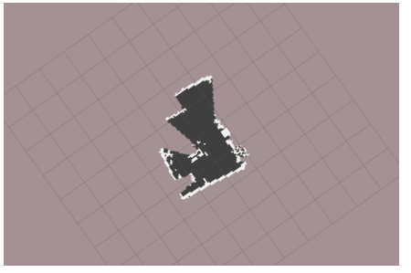
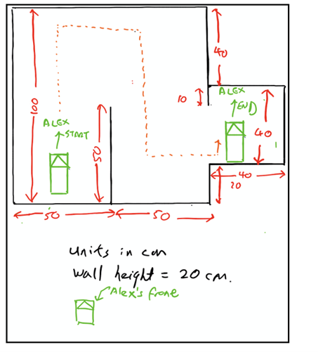

  
  

Alex is tele-operated from a laptop, through which , a map is plotted through hector slam algorithm to figure out the layout of an unknown maze. The commands from the laptop are sent to
the Master Control Program on the Raspberry Pi mounted on the robot, and the MCP in turn translates the command into actual movement control signals for the connected Arduino board. The map
is ultimately produced on Rviz.

For this project, i was mainly responsible for assembling the hardware cohesively, i also configured the motors wheel rotation and the Pi directional command. 

In overall, we start by doing a SSH into pi terminal from laptop to give commands to PI remotely. Give directional command to Pi and write a program to translate to signals to Arduino Uno, for it to interpret andcontrol the motor direction (wheels direction). Then we can activate lidar to start scanning. Finallym, we launch Rviz/GNUplot to view the plotted map. 

<figure class="video_container">
  <iframe width="560" height="315" src="https://www.youtube.com/embed/Ss2t-jPKTgU" frameborder="0" allow="accelerometer; autoplay; clipboard-write; encrypted-media; gyroscope; picture-in-picture" allowfullscreen></iframe>
</figure>

