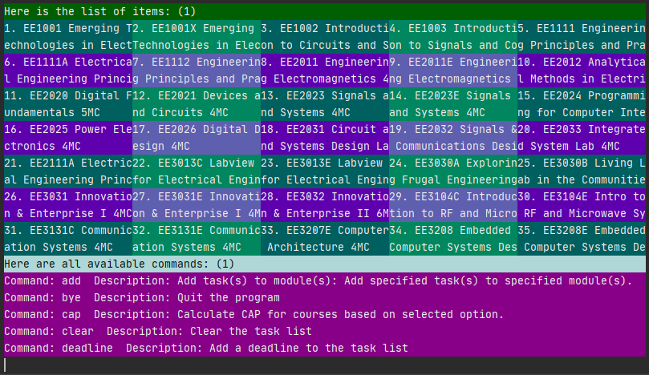

Domsun is a Desktop Command Line Interface (CLI) program that allows users to manage tasks and modules.
Domsun is targeted at busy NUS students who want to manage their tasks and modules well to achieve their dream CAP.
Users will be able to browse and select modules, create and arrange tasks, add tasks to modules,
create reminders, calculate and set goals for their MCs / CAPs.

In this project, i gained experience with Java, OOP and Agile Processes and various testing methodologies to improve code quality. 

Source: <a href="https://github.com/scjx123/tp"><i class="large github icon"></i>scjx123/tp</a>